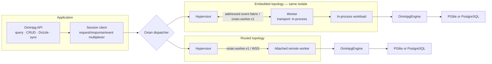
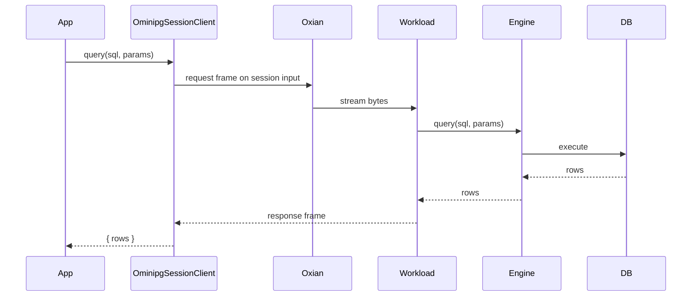

# Architecture

Ominipg is an Oxian-native database workload. The public client, database
engine, and execution topology are separate layers, so the same database API can
run embedded in another application or on a worker attached to an Oxian
Hypervisor.

## Thirty-thousand-foot view



One `Ominipg.connect()` call opens one long-lived `ominipg.session.v1` dispatch.
That dispatch creates one `OminipgEngine`, and the engine owns all mutable state
for the lifetime of the connection. There are no module-level database
singletons.

## Layers

### Public API

`src/client/index.ts` owns the user-facing `Ominipg` class. It provides:

- raw queries and transaction callbacks;
- sync, sequence sync, snapshots, and diagnostics;
- PostgreSQL `LISTEN`/`NOTIFY` subscriptions;
- CRUD helpers and the Drizzle proxy adapter;
- client lifecycle and typed events.

CRUD and Drizzle do not bypass the session. Both compile their operations to SQL
and call the same `Ominipg.query()` method as raw callers.

### Session client

`src/session/client.ts` adapts an Oxian dispatch handle into a stateful client:

- a monotonically increasing request ID correlates responses;
- multiple request promises share one input/output byte stream;
- notification and subscription-state frames are delivered as events;
- request timeouts reject the caller;
- closing rejects pending requests and closes subscriptions;
- injected dispatchers remain owned by the embedding application.

The accepted dispatcher shape is the minimal Oxian `Dispatcher` contract.
Hypervisors expose that contract directly, and an application can provide
another adapter with the same lifecycle.

### Ominipg session protocol

`src/session/protocol.ts` defines `ominipg.session.v1`. Operations are:

- `initialize`
- `query`
- `sync`
- `sync-sequences`
- `dump-data-dir`
- `diagnostics`
- `listen`
- `unlisten`
- `notify`
- `close`

Every frame has an Ominipg protocol identifier and is one of `request`,
`response`, or `event`. Errors cross the boundary as name, message, and optional
stack fields, then become `Error` objects on the client.

`src/session/codec.ts` is runtime-neutral and handles arbitrary stream chunk
boundaries. A frame contains:

```text
4 bytes  "OMPG"
4 bytes  tagged-JSON header length (uint32, big endian)
4 bytes  binary attachment length (uint32, big endian)
N bytes  UTF-8 tagged JSON
M bytes  raw binary attachments
```

Tagged values preserve `bigint`, `Date`, `Uint8Array`/buffers, `undefined`,
non-finite numbers, and negative zero. Binary values remain raw attachments, so
PGlite snapshots do not pay base64 expansion. Functions, symbols, cyclic values,
and custom object instances are rejected because they are process-local.

The default decoder limit is 512 MiB per frame. A routed client can set
`oxian.maxFrameBytes`; a workload owner can set
`createOminipgWorkload({ maxFrameBytes })`. Oxian can split one Ominipg frame
across any number of transport chunks.

### Workload

`createOminipgWorkload()` returns an Oxian `WorkerWorkHandler`. Each invocation:

1. resolves runtime-owned database providers;
2. creates one `OminipgEngine`;
3. reads requests sequentially from the operation input stream;
4. writes correlated responses and asynchronous database events;
5. closes engine resources when the client closes, input ends, or the Oxian
   operation is cancelled.

Sequential request execution gives each session deterministic query order and
allows a PostgreSQL transaction to retain one checked-out pool client between
`BEGIN` and `COMMIT`/`ROLLBACK`.

Dependencies can be fixed or selected from Oxian metadata:

```ts
createOminipgWorkload({
  dependencies: { pgliteProvider, pgProvider },
  resolveDependencies: async (metadata) => dependenciesFor(metadata.tenantId),
});
```

Fixed dependencies take precedence over provider descriptors sent by the client.
This is the preferred model for remote or multi-runtime workers.

### Engine

`src/worker/engine.ts` is the stateful domain façade. The `src/worker/` name is
retained for package compatibility, but these modules do not install Web Worker
or `worker_threads` listeners.

Every `EngineState` owns:

- the main PGlite adapter or PostgreSQL pool;
- the optional sync pool and logical replication service;
- provider callbacks and PGlite configuration;
- schema metadata and active extensions;
- edge identity, LWW settings, and recently pushed rows;
- sync timers and lifecycle flags;
- notification subscriptions and listener hub.

The engine performs no runtime-global filesystem or memory probing. Optional
host capabilities such as RSS measurement are injected.

## Topologies and ownership

### Private embedded — default

When `oxian` is absent, Ominipg creates a private Hypervisor and an in-process
Worker carrying one workload with capacity one, then dispatches the session
through the Hypervisor. `db.close()` closes the engine, Worker, and Hypervisor.

This path stays inside one JavaScript isolate. Oxian carries encoded control and
binary frames through an addressed event fabric and runs the same handshake,
readiness, heartbeat, lease, acceptance, credit, cancellation, drain, and
shutdown state machines as WebSocket Workers. It creates no socket, Web Worker,
worker thread, or runtime isolate.

### Shared embedded

An application can place a Worker carrying `createOminipgWorkload()` on its own
Hypervisor and pass that Hypervisor as `oxian.dispatcher`. Multiple database
sessions can share the topology while retaining separate engines. `db.close()`
closes only its session; the application owns the shared Worker and Hypervisor.

This is the intended embedding model for a library such as Copilotz: Copilotz
can expose worker-enabled functionality without opening a server or WebSocket.

### Hypervisor-routed

The same workload handler can run in an Oxian worker connected outbound to a
Hypervisor. The server-side application passes that Hypervisor (or an adapter)
as the Ominipg dispatcher. Oxian handles selection, capacity, acceptance,
cancellation, and remote byte-stream transport.

The Ominipg client is not itself a browser-to-Hypervisor requester protocol. A
browser or another remote caller needs an application-owned ingress/bridge to a
process that can dispatch work.

## Database flows

### Query



### Transaction

`Ominipg.transaction()` sends `BEGIN`, invokes the callback, then sends `COMMIT`
or `ROLLBACK`. PGlite already has one backend per engine. The PostgreSQL adapter
checks out a pool client on `BEGIN` and retains it for every session query until
the transaction ends. Closing an engine with an active transaction attempts a
rollback before releasing the connection.

A transaction is session-scoped, not an application-wide lock. Avoid unrelated
concurrent calls on the same client during its callback.

### Sync

Sync belongs to the engine session:

1. bootstrap creates user schema and sync infrastructure;
2. initial synchronization reconciles local and remote data;
3. logical replication pulls remote changes when configured;
4. local triggers track changes;
5. `sync()` pushes a batch to PostgreSQL;
6. edge identity and the configured LWW column suppress echoes and resolve
   supported conflicts.

Session shutdown stops replication and timers before closing database pools.

### Notifications

PostgreSQL notifications are asynchronous session events. The first `listen()`
creates one listener hub and pins one pool connection; channels and callbacks
are multiplexed over it. Connection failure enters `reconnecting`, then active
channels are reissued with capped backoff. `pgPoolMax` must be at least two.

PGlite and sync-only notification use is rejected. Notifications remain
best-effort wake-up signals; durable state belongs in tables.

## Runtime boundary

The public dependency closure uses `crypto`, Web Streams, typed arrays,
`TextEncoder`/`TextDecoder`, `Blob`, timers, and promises. It contains no direct
Deno, Node, Bun, Cloudflare, Web Worker, `postMessage`, or `worker_threads` API.

Database providers are capability boundaries. A runtime-neutral session does not
make every database engine available in every runtime: filesystem-backed PGlite
needs filesystem support, and PostgreSQL/logical replication need a compatible
driver and network model.

## Design consequences

- Embedded execution is lighter than loopback WebSocket execution, but slightly
  heavier than a direct method call because it preserves the unified framed
  session contract.
- Same-isolate execution provides lifecycle, scheduling, cancellation, and
  ownership—not CPU, memory, crash, or security isolation.
- Streams are the data plane because they carry backpressure and cancellation;
  JavaScript callbacks/events are used only for local observation.
- One long-lived dispatch preserves connection, transaction, subscription, and
  sync state naturally.
- Explicit providers keep runtime-specific imports out of the core and make
  worker runtime ownership visible.
- An injected dispatcher or Hypervisor always outlives individual Ominipg
  sessions unless its application owner shuts it down.

## Related documentation

- [Oxian embedding and routing](./OXIAN.md)
- [Runtime support](./RUNTIMES.md)
- [Migrating to 0.9](./MIGRATION_0_9.md)
- [Sync](./SYNC.md)
- [PostgreSQL notifications](./NOTIFICATIONS.md)
